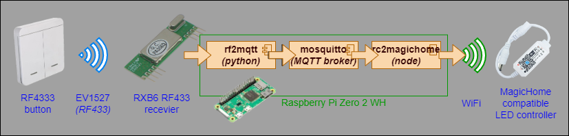

# Installation

## Startup script

Follow these steps:
```sh
git clone https://github.com/rpeyron/rc2magichome
sudo sh install.sh
```

The install script will:
- Check if node is install
- Install required node modules
- Copy default configuration if none exists (see configuration below)
- Create symbolic link in /usr/local/bin
- Register systemd start script
- Start rc2magichome


## Docker

You can also use docker.

Build with:
```
./build.sh
```

Run with:
```
docker run --network host -v /data/rc2magichome/config.local.js:/app/config.local.js rc2magichome
```

Or use `docker-compose.yml`  if you prefer docker-compose

# Typical architecture



# Configuration

To configure, please update config.local.js (local file, will not be updated by upstream updates)
You should remove any default configuration and only keep the one you need to modify.
You need to restart the systemd after any configuration update with `systemctl restart rc2magichome.service` 

Minimal configuration is:
```js
export default {
    mqttConnectString: "mqtt://192.168.0.170",    // Connection string to MQTT server
    mqttConnectTopic: "rc",           // MQTT Topic to read remote codes
    updateStatesIntervalMs: 5000,     // Interval (ms) between each cached state polling
    scanIntervalMs: 5 * 60 * 1000,    // Interval (ms) between each device discovery/updates

    /** @type Array<import("./devices-cache").DeviceDefinition> */
    devices: [
        { title: "MyDevice1", id: "0123456789AB", address: "192.168.1.15" },
    ],

    /** @type Array<import("./remote").Remote> */
    remotes: [
        /* Example for a simple (and most common) switch for a device */
        {
            title: "MyToggleSwitch",
            rc: "1234567",
            toggle: ["MyDevice1"],
        },
    ],
}
```


And more advanced config can be done to include custom functions:
```js
    (...)
    /** @type Array<import("./remote").Remote> */
    remotes: [
        /* Example of more advanced custom function on a set of devices to have multiple levels on the same switch */
        {
            title: "MyCustomSwitch",
            rc: "124781",
            devices: ["MyDevice1", "MyDevice2"],
            function: async (devices, states) => {
                let curState = states[0]
                if (!curState?.on) {
                    devices.forEach(async d => d && await d.setWhite(10) && await d.setPower(true))
                } else if (curState?.on && (curState?.white == 10 || curState?.white == 255)) {
                    devices[0]?.setWhite(20)
                    devices[1]?.setWhite(100)
                } else if (curState?.on && (curState?.white == 50)) {
                    devices[0]?.setWhite(255)
                    devices[1]?.setWhite(255)
                } else {
                    devices[0]?.setWhite(50)
                    devices[1]?.setWhite(255)
                }
            }
        },
    ],
    (...)
```

See `src/config.js` for full configuration options documentation.
